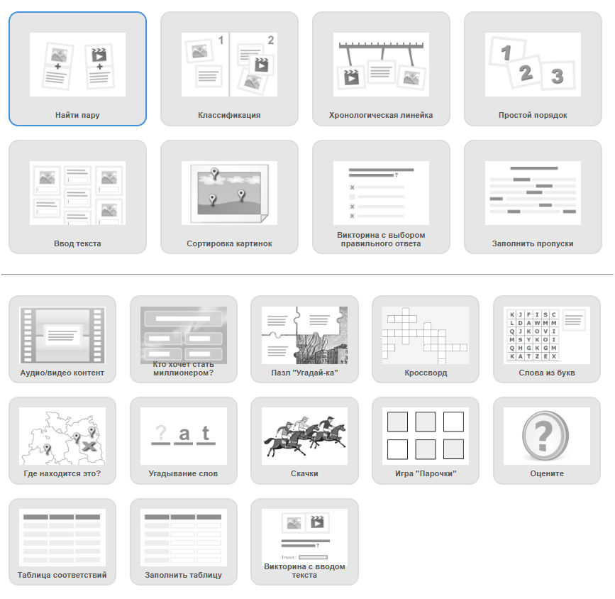
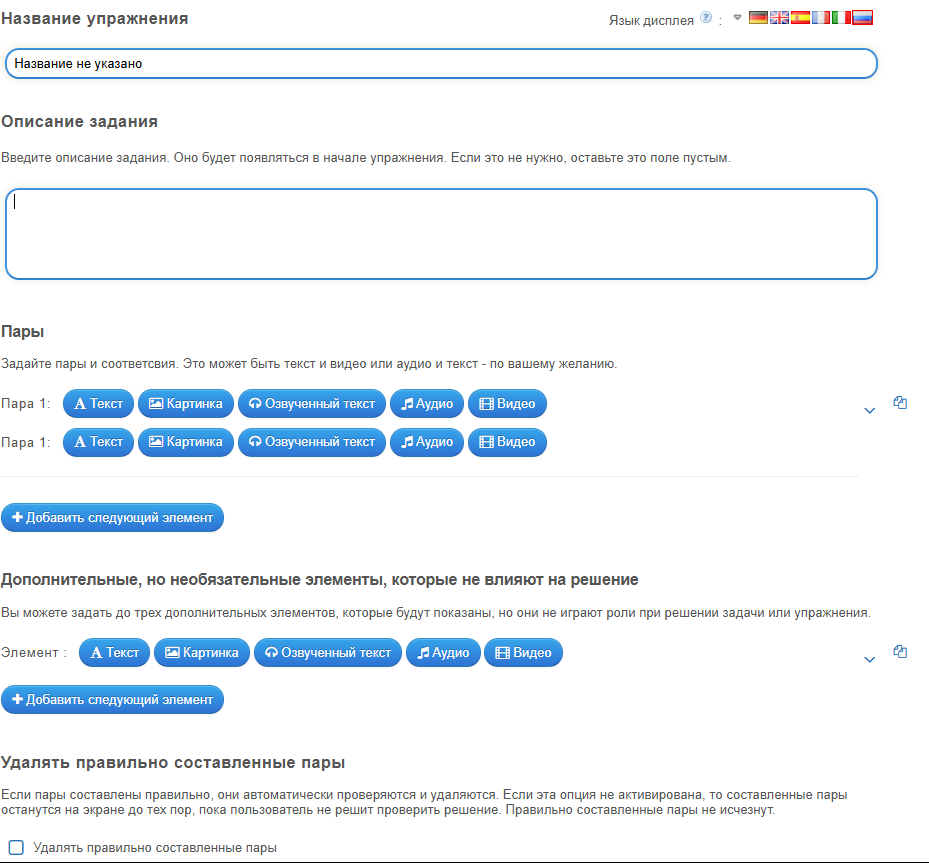
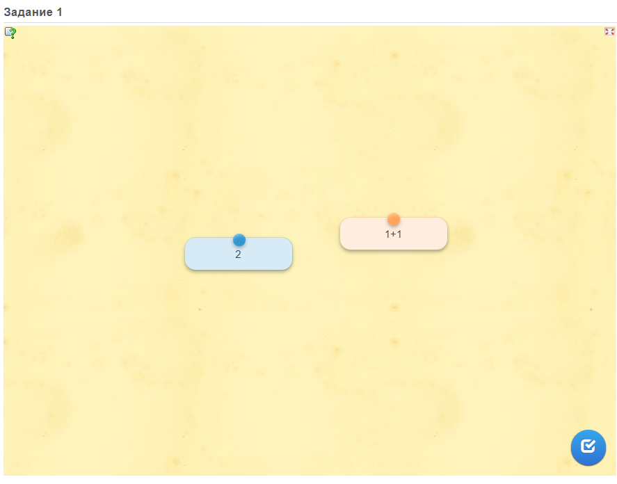

# Лабораторная работа № 2
## Выполнил: Гневнов А.Е., ИВТ 2.1
### №1. Определение SCORM
SCORM (Sharable Content Object Reference Model) — это набор стандартов и спецификаций для электронного обучения, разработанный для обеспечения совместимости учебных материалов с различными системами управления обучением (LMS). SCORM определяет, как контент должен быть структурирован, упакован и взаимодействовать с LMS, чтобы обеспечить повторное использование, отслеживание прогресса и сохранение результатов учащихся.

### №2. Преимущества ресурсов в стандарте SCORM
- Совместимость: Контент работает в любой LMS, поддерживающей SCORM (например, Moodle, Canvas).

- Отслеживание данных: Фиксация результатов тестов, времени изучения, прогресса и завершения заданий.

- Повторное использование: Учебные модули (SCO — Sharable Content Objects) можно переносить между курсами и платформами без изменений.

- Интерактивность: Поддержка мультимедиа, тестов, симуляций, что повышает вовлеченность учащихся.

- Стандартизация: Упрощает разработку и обмен материалами между образовательными учреждениями и авторами.

- Автоматизация: Автоматическая отправка оценок в LMS, упрощающая администрирование курсов.

### №3. Инструменты SCORM в LearningApps:
| **Название инструмента**         | **Описание**                                                                 | **Применение в SCORM**                                                                 |
|----------------------------------|-----------------------------------------------------------------------------|---------------------------------------------------------------------------------------|
| **Кроссворд**                    | Создание интерактивных кроссвордов с вопросами и подсказками.               | Экспортируется как HTML → упаковывается в SCORM-пакет для проверки терминологии.      |
| **Викторина с выбором ответа**   | Тесты с вариантами ответов (один/несколько правильных).                     | Интегрируется в SCORM-курсы через конвертеры (eXeLearning, iSpring) для оценки знаний.|
| **Заполнить пропуски**           | Упражнения с текстом, где нужно вставить пропущенные слова.                 | Отслеживание правильных ответов через SCORM-пакет в LMS.                              |
| **Сортировка картинок**          | Задания на группировку изображений по категориям или признакам.             | Используется для развития аналитического мышления → данные сохраняются в LMS.         |
| **Хронологическая линейка**      | Расположение событий, дат или этапов в правильном порядке.                  | Экспортируется в SCORM → проверка понимания последовательности.                       |
| **Пазл "Угадай-ка"**             | Сборка пазлов с образовательным контентом (например, карты, термины).       | Повышает вовлеченность → результаты фиксируются в SCORM-отчетах.                      |
| **Игра "Парочки"**               | Сопоставление пар элементов (например, вопрос-ответ, термин-определение).   | Закрепление материала → интеграция через SCORM-пакет для отслеживания прогресса.      |
| **Аудио-видео контент**          | Вставка видео с вопросами или интерактивными заданиями.                     | SCORM-курсы с мультимедиа → отслеживание времени просмотра и активности.              |
| **Кроссворд "Слова из букв"**    | Составление слов из заданного набора букв.                                  | Экспорт в SCORM через HTML → оценка словарного запаса в LMS.                          |
| **Таблица соответствий**         | Сопоставление данных из двух столбцов (например, даты и события).           | Используется для проверки ассоциаций → результаты передаются в SCORM-систему.         |

*Пример создания:*  
1. выбираем шаблон

2. Заполняем все пункты

3. Тестируем

