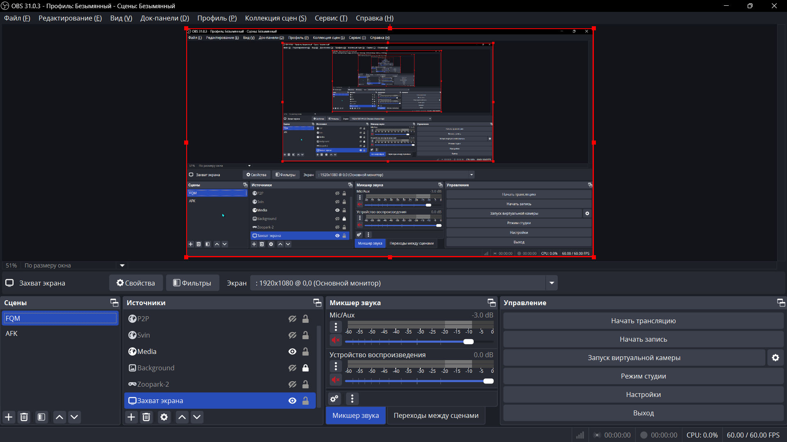
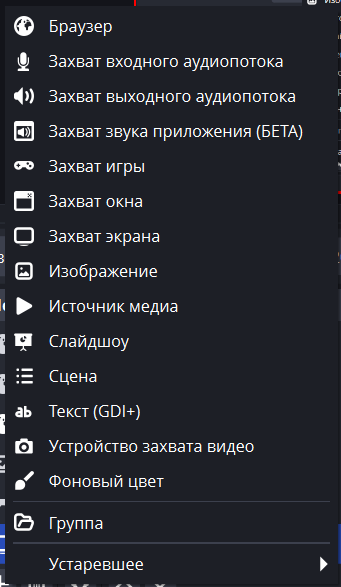
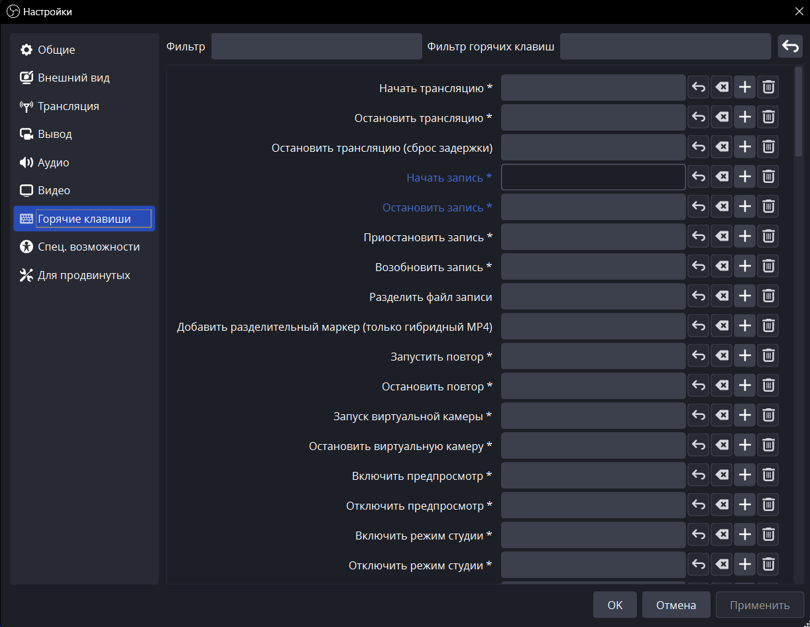
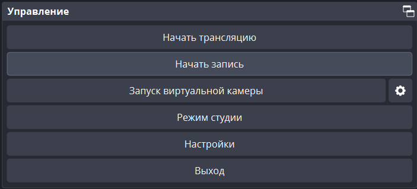
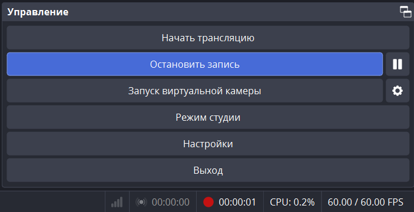

# 1. Тема и сценарий скринкаста (2 минуты)

**Тема:** "Как быстро отредактировать фото в Adobe Photoshop: основы за 2 минуты".

**Сценарий:**
1. **Введение (10 сек):**  
   "День добрый! Сегодня я покажу, как за 2 минуты улучшить ваше фото в Photoshop. Мы сделаем коррекцию цвета, обрежем кадр и сохраним результат."

2. **Основная часть (1 мин 40 сек):**  
   - Открытие фото: "Нажмите *Файл → Открыть* и выберите изображение."  
   - Баланс цвета: "Перейдите в *Изображение → Коррекция → Автотон* для автоматической настройки цвета."  
   - Обрезка: "Выберите инструмент *Рамка*, задайте пропорции и обрежьте ненужные области."  
   - Яркость/Контраст: "В *Изображение → Коррекция → Яркость/Контраст* увеличьте значения для чёткости."  
   - Экспорт: "Сохраните через *Файл → Экспортировать как* в формате JPEG."

3. **Заключение (10 сек):**  
   "Готово! Теперь ваше фото выглядит профессионально. Спасибо за просмотр!"

---

# 2. Сравнение программ для записи экрана

| **Параметр**       | **OBS Studio**               | **NVIDIA ShadowPlay**        | **Camtasia**                 |
|---------------------|------------------------------|-------------------------------|------------------------------|
| **Цена**            | Бесплатно                    | Бесплатно (с GPU NVIDIA)      | Платная ($299)               |
| **Простота**        | Средняя (требует настройки)  | Высокая                       | Высокая                      |
| **Качество записи** | До 4K 60fps                  | До 4K 60fps (с HDR)           | До 1080p 60fps               |
| **Особенности**     | Потоковая трансляция, плагины| Фоновый режим      | Встроенный редактор, эффекты |
| **Плюсы**           | Гибкость, кроссплатформенность | Минимальное влияние на производительность   | Профессиональный монтаж      |
| **Минусы**          | Сложен для новичков          | Только для NVIDIA             | Высокая стоимость            |

---

# 3. Алгоритм работы с программой (OBS Studio) 
1. Запускаем программу  

2. Добавляем источник для записи  
  
3. После выбора источника и его настройки начинаем запись(для удобства можно назначить горячую клавишу)  

  
4. По завершению заканчиваем запись  
