# Создание и настройка VDS, подключение к серверу
## Выполнил: Гневнов А.Е, ИВТ 2.1

### Купленный домен
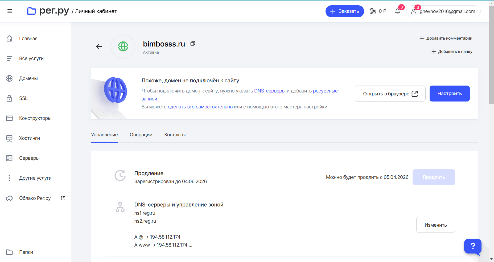

### Купленный сервер
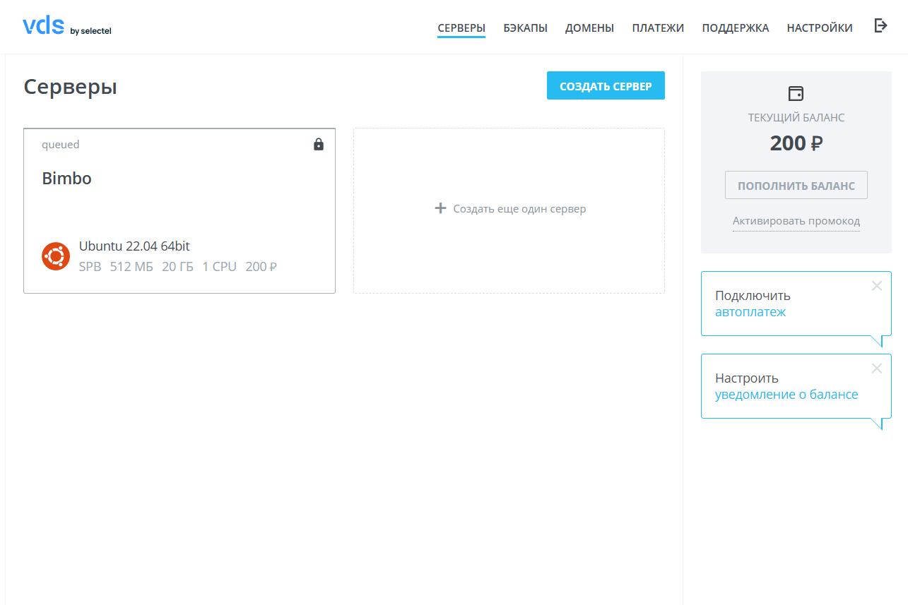

### Подключение через RSA-SSH
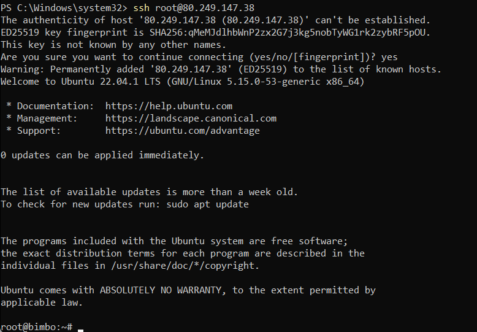

### Подключение домена
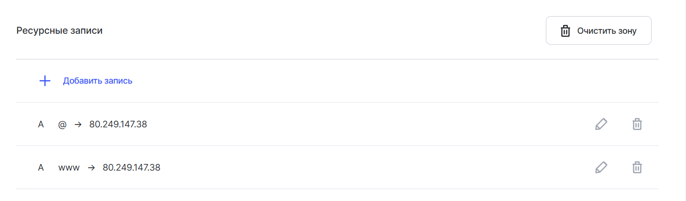

### апдейтим через apt update и apt upgrade
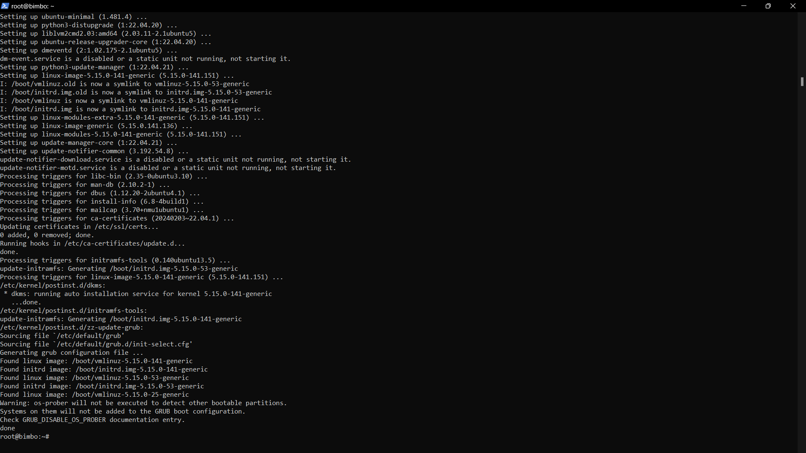

### Установка разрешений
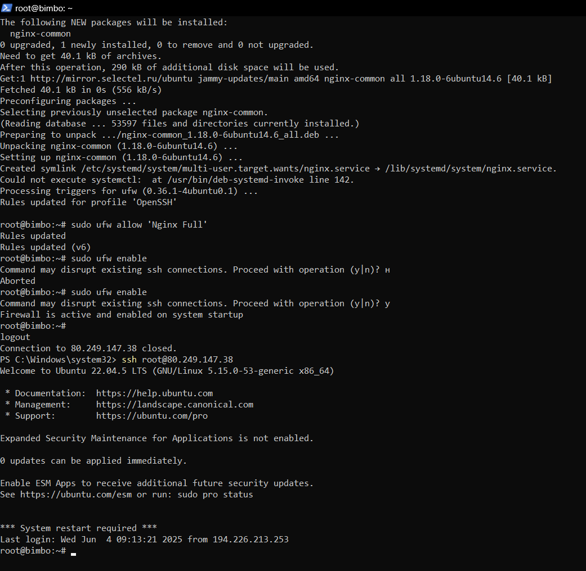

### Ставим Nginx и настраиваем
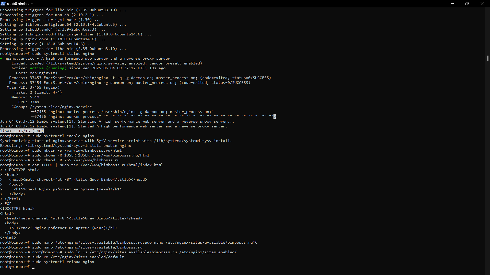

### Стартовая страница по ip
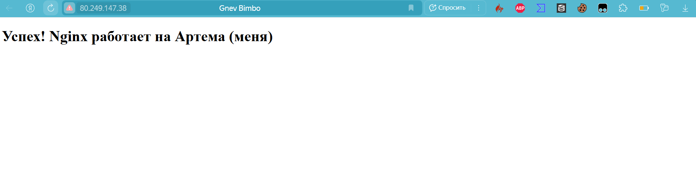

### Стартовая страница по домену
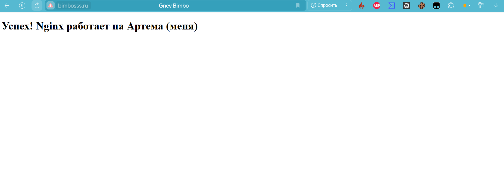

### пингуем
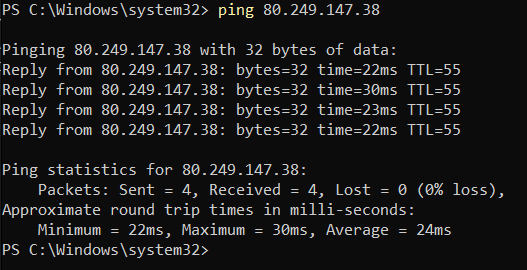
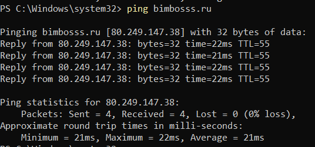