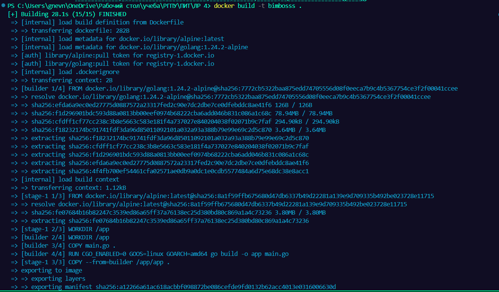
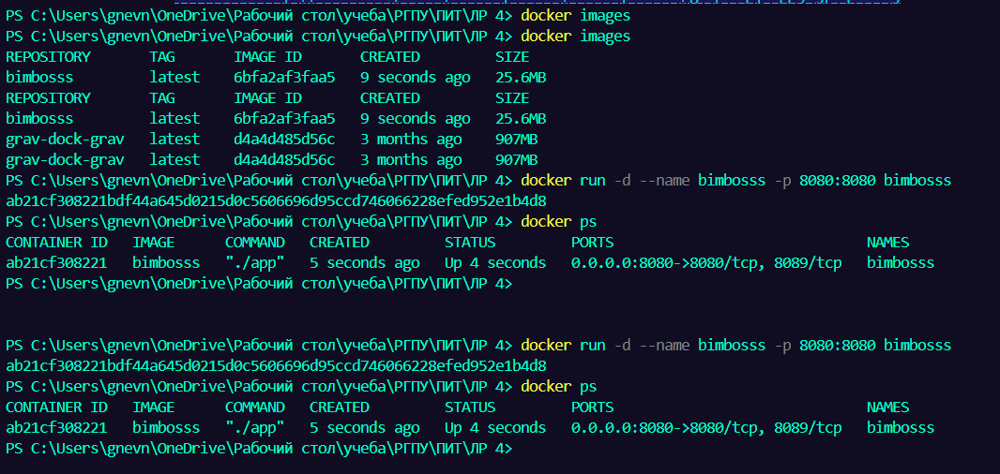
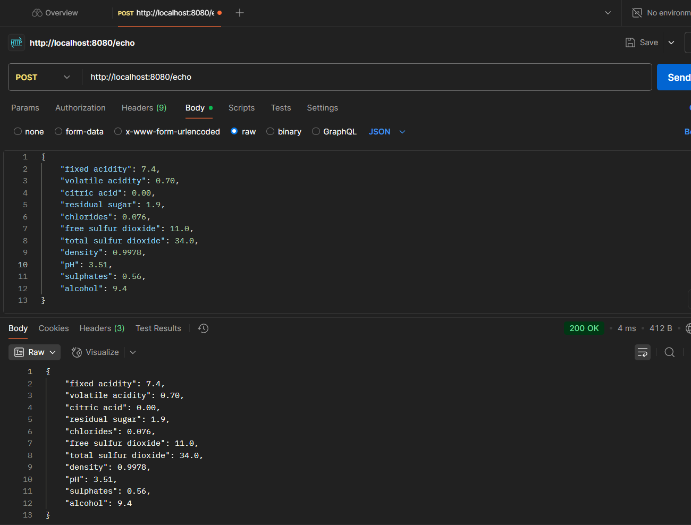

# Установке докера и запуске статичного сайта или Node-приложения
## Выполнил: Гневнов А.Е., ИВТ 2.1

### Создание сервера
```go
package main

import (
	"io"
	"log"
	"net/http"
)

func main() {
	http.HandleFunc("/", func(w http.ResponseWriter, r *http.Request) {
		w.Header().Set("Content-Type", "text/plain; charset=utf-8")
		w.WriteHeader(http.StatusOK)
		_, err := w.Write([]byte("Приложение go работает"))
		if err != nil {
			log.Println("Не удалось записать ответ:", err)
		}
	})

	http.HandleFunc("/echo", func(w http.ResponseWriter, r *http.Request) {
		if r.Method != http.MethodPost {
			w.Header().Set("Allow", http.MethodPost)
			http.Error(w, "Method Not Allowed", http.StatusMethodNotAllowed)
			return
		}

		w.Header().Set("Content-Type", "application/octet-stream")
		if _, err := io.Copy(w, r.Body); err != nil {
			http.Error(w, "Internal Server Error", http.StatusInternalServerError)
			log.Println("Ошибка при копировании тела запроса:", err)
		}
	})

	if err := http.ListenAndServe(":8080", nil); err != nil {
		log.Fatalf("Ошибка запуска сервера: %v", err)
	}
}
```

### DOCKERFILE
```
FROM golang:1.24.2-alpine AS builder

WORKDIR /app

COPY main.go .

RUN CGO_ENABLED=0 GOOS=linux GOARCH=amd64 go build -o app main.go

FROM alpine:latest

WORKDIR /app

COPY --from=builder /app/app .

EXPOSE 8089

CMD ["./app"]
```

### билд и запуск
*Вводим по очереди команды для билда и запуска*
``` 
docker build -t bimbosss .
docker run -d --name bimbosss -p 8080:8080 bimbosss
```
   
   

*Проверяем*
```
docker images
docker ps
```

### Проверка работы GET и POST
*GET*   
   
*POST*   
