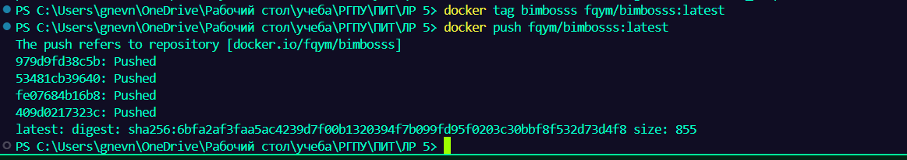
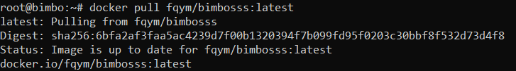
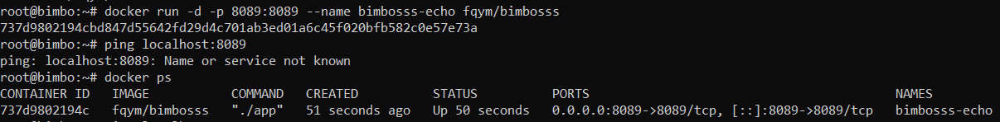
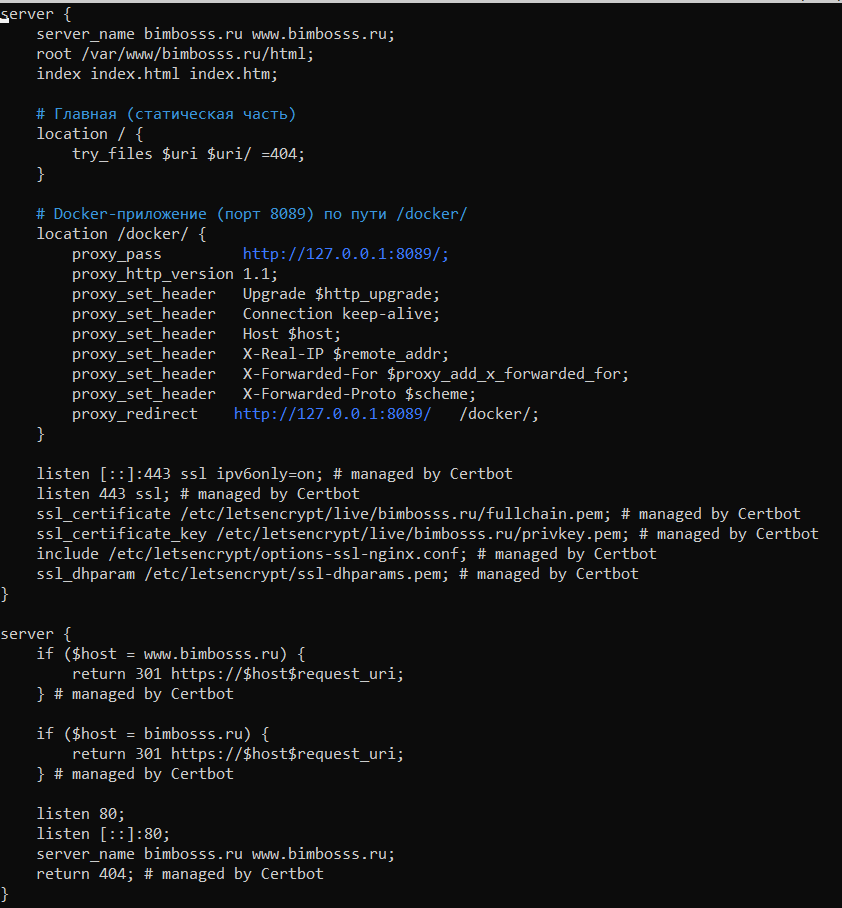
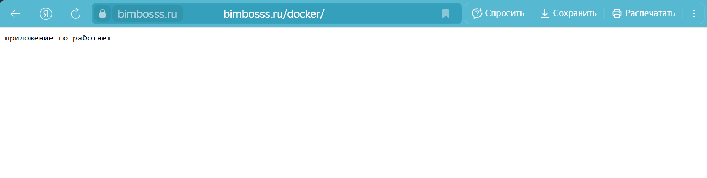

# Docker BPR (Build & Push & Run)
## Выполнил: Гневнов А.Е.,ИВТ 2.1

### Конфиг Dockerfile

``` Dockerfile
FROM golang:1.24.2-alpine AS builder

WORKDIR /app

COPY main.go .

RUN CGO_ENABLED=0 GOOS=linux GOARCH=amd64 go build -o app main.go

FROM alpine:latest

WORKDIR /app

COPY --from=builder /app/app .

EXPOSE 8089

CMD ["./app"]
```
### Программа на Go

``` go
package main

import (
	"io"
	"log"
	"net/http"
)

func main() {
	http.HandleFunc("/", func(w http.ResponseWriter, r *http.Request) {
		w.Header().Set("Content-Type", "text/plain; charset=utf-8")
		w.WriteHeader(http.StatusOK)
		_, err := w.Write([]byte("Приложение go работает"))
		if err != nil {
			log.Println("Не удалось записать ответ:", err)
		}
	})

	http.HandleFunc("/echo", func(w http.ResponseWriter, r *http.Request) {
		if r.Method != http.MethodPost {
			w.Header().Set("Allow", http.MethodPost)
			http.Error(w, "Method Not Allowed", http.StatusMethodNotAllowed)
			return
		}

		w.Header().Set("Content-Type", "application/octet-stream")
		if _, err := io.Copy(w, r.Body); err != nil {
			http.Error(w, "Internal Server Error", http.StatusInternalServerError)
			log.Println("ошибка при копировании тела запроса:", err)
		}
	})

	if err := http.ListenAndServe(":8080", nil); err != nil {
		log.Fatalf("Ошибка запуска сервера: %v", err)
	}
}
```

### Пушим Docker image в Docker Hub



### Устанавливаем docker на сервера

```
# Add Docker's official GPG key:
sudo apt-get update
sudo apt-get install ca-certificates curl
sudo install -m 0755 -d /etc/apt/keyrings
sudo curl -fsSL https://download.docker.com/linux/ubuntu/gpg -o /etc/apt/keyrings/docker.asc
sudo chmod a+r /etc/apt/keyrings/docker.asc

# Add the repository to Apt sources:
echo \
  "deb [arch=$(dpkg --print-architecture) signed-by=/etc/apt/keyrings/docker.asc] https://download.docker.com/linux/ubuntu \
  $(. /etc/os-release && echo "${UBUNTU_CODENAME:-$VERSION_CODENAME}") stable" | \
  sudo tee /etc/apt/sources.list.d/docker.list > /dev/null
sudo apt-get update
```

```
sudo apt-get install docker-ce docker-ce-cli containerd.io docker-buildx-plugin docker-compose-plugin
```

### Пулим докер image на сервера



### запускаем контейнер



### Настройка Ngnix конфига



### Проверяем работу



### Ссылка на Docker Hub

[Репа](https://hub.docker.com/repository/docker/fqym/bimbosss/general)