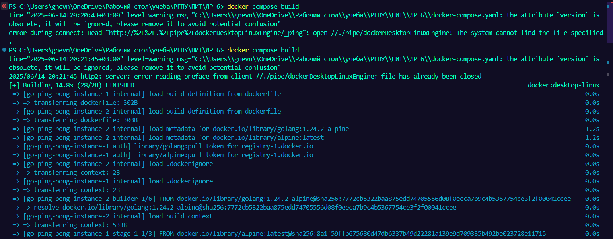
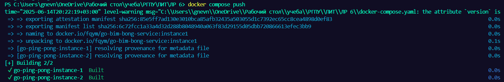
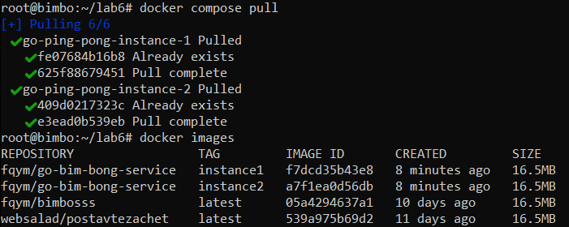
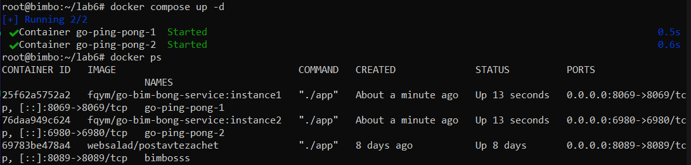
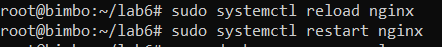
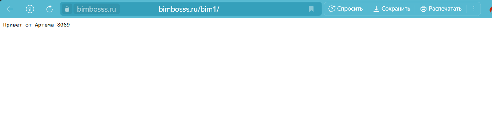
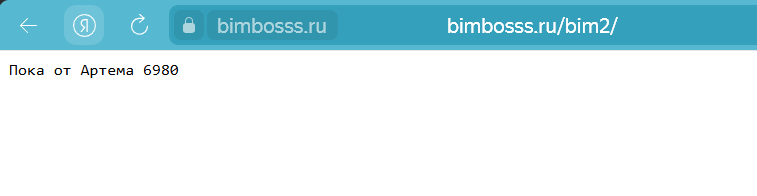

# Docker-Compose First Look
## Выполнил: Гневнов А.Е.,ИВТ 2.1

### Создание докер файлов и файл приложением x2
``` go
package main

import (
	"fmt"
	"log"
	"net/http"
)

func main() {
	port := "8069"

	http.HandleFunc("/", func(w http.ResponseWriter, r *http.Request) {
		fmt.Fprintf(w, "Привет от Артема %s", port)
	})

	log.Printf("Сервер запущен на порту %s\n", port)
	if err := http.ListenAndServe(":"+port, nil); err != nil {
		log.Fatalf("Ошибка запуска БИМБО: %v", err)
	}
}

```

``` dockerfile
FROM golang:1.24.2-alpine AS builder

WORKDIR /app

COPY go.mod ./
RUN go mod download

COPY main.go .
RUN CGO_ENABLED=0 GOOS=linux GOARCH=amd64 go build -o app main.go

FROM alpine:latest

WORKDIR /app

COPY --from=builder /app/app .

EXPOSE 8069

CMD ["./app"]

```

``` go
package main

import (
	"fmt"
	"log"
	"net/http"
)

func main() {
	port := "6980"

	http.HandleFunc("/", func(w http.ResponseWriter, r *http.Request) {
		fmt.Fprintf(w, "Пока от Артема %s", port)
	})

	log.Printf("Сервер запущен на порту %s\n", port)
	if err := http.ListenAndServe(":"+port, nil); err != nil {
		log.Fatalf("Ошибка запуска БИМБО: %v", err)
	}
}

```

``` dockerfile
FROM golang:1.24.2-alpine AS builder

WORKDIR /app

COPY go.mod  ./
RUN go mod download

COPY main.go .
RUN CGO_ENABLED=0 GOOS=linux GOARCH=amd64 go build -o app main.go

FROM alpine:latest

WORKDIR /app

COPY --from=builder /app/app .

EXPOSE 6980

CMD ["./app"]

```
### Создание докер композа
``` yaml
version: "3.8"

services:

  go-ping-pong-instance-1:
    build:
      context: ./Serv-1
      dockerfile: Dockerfile
    image: fqym/go-bim-bong-service:instance1
    container_name: go-ping-pong-1
    environment:
      - APP_PORT=8080
      - PONG_MESSAGE=Greetings from Go App Instance 1!
    ports:
      - "8069:8080"
    restart: always

  go-ping-pong-instance-2:
    build:
      context: ./Serv-2
      dockerfile: Dockerfile
    image: fqym/go-bim-bong-service:instance2
    container_name: go-ping-pong-2
    environment:
      - APP_PORT=8080
      - PONG_MESSAGE=Hello from Go App Instance 2!
    ports:
      - "6980:8080"
    restart: always

```

### Билдим наше приложение с помощью докеркомпоз, который использует докер файлы из папок с приложениями Go (НЕ ЗАБЫВАЕМ ВКЛЮЧИТЬ ДОКЕР ДЕМОН, А ТО Я В ПЕРВЫЙ РАЗ ЗАБЫЛ)



### Пушим на Докер Hub



### Создаём докер композ на сервере

``` yaml
services:                                                                                                                 go-ping-pong-instance-1:                                                                                                  image: fqym/go-bim-bong-service:instance1                                                                               container_name: go-ping-pong-1                                                                                          ports:                                                                                                                    - "8069:8069"                                                                                                         restart: always                                                                                                                                                                                                                               go-ping-pong-instance-2:                                                                                                  image: fqym/go-bim-bong-service:instance2                                                                               container_name: go-ping-pong-2                                                                                          ports:                                                                                                                    - "6980:6980"                                                                                                         restart: always  
```

### Пуллим образы контейнеры с докер хаба (и за одно проверяем))



### Билдим/Запускаем контейнеры через докер композ (и тоже за одно проверяем)



### Редактируем Nginx

```
server {                                                                                                                                                                                                               server_name bimbosss.ru www.bimbosss.ru;                                                                                                                                                                           root /var/www/bimbosss.ru/html;                                                                                                                                                                                    index index.html index.htm;                                                                                                                                                                                                                                                                                                                                                                                                           # Главная (статическая часть)                                                                                                                                                                                      location / {                                                                                                                                                                                                           try_files $uri $uri/ =404;                                                                                                                                                                                     }                                                                                                                                                                                                                                                                                                                                                                                                                                     # Docker-приложение (порт 8089) по пути /docker/                                                                                                                                                                   location /docker/ {                                                                                                                                                                                                    proxy_pass         http://127.0.0.1:8089/;                                                                                                                                                                         proxy_http_version 1.1;                                                                                                                                                                                            proxy_set_header   Upgrade $http_upgrade;                                                                                                                                                                          proxy_set_header   Connection keep-alive;                                                                                                                                                                          proxy_set_header   Host $host;                                                                                                                                                                                     proxy_set_header   X-Real-IP $remote_addr;                                                                                                                                                                         proxy_set_header   X-Forwarded-For $proxy_add_x_forwarded_for;                                                                                                                                                     proxy_set_header   X-Forwarded-Proto $scheme;                                                                                                                                                                      proxy_redirect    http://127.0.0.1:8089/   /docker/;                                                                                                                                                           }                                                                                                                                                                                                                                                                                                                                                                                                                                                                                                                                                                                                                                                        location /bim1/ {                                                                                                                                                                                                      proxy_pass         http://127.0.0.1:8069/;                                                                                                                                                                         proxy_http_version 1.1;                                                                                                                                                                                            proxy_set_header   Upgrade           $http_upgrade;                                                                                                                                                                proxy_set_header   Connection        keep-alive;                                                                                                                                                                   proxy_set_header   Host              $host;                                                                                                                                                                        proxy_set_header   X-Real-IP         $remote_addr;                                                                                                                                                                 proxy_set_header   X-Forwarded-For   $proxy_add_x_forwarded_for;                                                                                                                                                   proxy_set_header   X-Forwarded-Proto $scheme;                                                                                                                                                                      proxy_redirect     off;                                                                                                                                                                                        }                                                                                                                                                                                                                                                                                                                                                                                                                                     location /bim2/ {                                                                                                                                                                                                      proxy_pass         http://127.0.0.1:6980/;                                                                                                                                                                         proxy_http_version 1.1;                                                                                                                                                                                            proxy_set_header   Upgrade           $http_upgrade;                                                                                                                                                                proxy_set_header   Connection        keep-alive;                                                                                                                                                                   proxy_set_header   Host              $host;                                                                                                                                                                        proxy_set_header   X-Real-IP         $remote_addr;                                                                                                                                                                 proxy_set_header   X-Forwarded-For   $proxy_add_x_forwarded_for;                                                                                                                                                   proxy_set_header   X-Forwarded-Proto $scheme;                                                                                                                                                                      proxy_redirect     off;                                                                                                                                                                                        }                                                                                                                                                                                                                                                                                                                                                                                                                                     listen [::]:443 ssl ipv6only=on; # managed by Certbot                                                                                                                                                              listen 443 ssl; # managed by Certbot                                                                                                                                                                               ssl_certificate /etc/letsencrypt/live/bimbosss.ru/fullchain.pem; # managed by Certbot                                                                                                                              ssl_certificate_key /etc/letsencrypt/live/bimbosss.ru/privkey.pem; # managed by Certbot                                                                                                                            include /etc/letsencrypt/options-ssl-nginx.conf; # managed by Certbot                                                                                                                                              ssl_dhparam /etc/letsencrypt/ssl-dhparams.pem; # managed by Certbot                                                                                                                                            }                                                                                                                                                                                                                                                                                                                                                                                                                                     server {                                                                                                                                                                                                               if ($host = www.bimbosss.ru) {                                                                                                                                                                                         return 301 https://$host$request_uri;                                                                                                                                                                          } # managed by Certbot                                                                                                                                                                                                                                                                                                                                                                                                                if ($host = bimbosss.ru) {                                                                                                                                                                                             return 301 https://$host$request_uri;                                                                                                                                                                          } # managed by Certbot                                                                                                                                                                                                                                                                                                                                                                                                                listen 80;                                                                                                                                                                                                         listen [::]:80;                                                                                                                                                                                                    server_name bimbosss.ru www.bimbosss.ru;                                                                                                                                                                           return 404; # managed by Certbot                                                                                                                                                                               }                                   
```
### Перезапускаем Nginx



### Проверяем приложениями



