# Самостоятельная работа 1, Тема 4
## Выполнил: Гневнов А.Е., ИВТ 2.1 

### **1. Графики**  
#### **1.1 Свечной график (OHLC)**  
- **Описание:** Отображает динамику цен (открытие, максимум, минимум, закрытие) в виде «свечей».  
- **Использование программистами:**  
  - Анализ биржевых данных, алгоритмический трейдинг, финансовые приложения.  
- **Особенности:**  
  - Зеленые/красные свечи показывают рост/падение цены.  
  - Подходит для анализа волатильности.  
- **Рекомендации:**  
  - Используйте библиотеки: **Plotly** (Python/JavaScript) для интерактивных графиков, **TradingView API** для интеграции с торговыми платформами .  
  - Для веб-приложений добавьте инструменты зумирования и подсказки.  
- **Доп. материалы:**  
  - [Свечной график](https://datavizcatalogue.com/RU/metody/svecnoj_grafik.html).  
  - Примеры реализации на GitHub: [Candlestick Chart with D3.js](https://github.com/d3/d3/wiki).  
- **Изображение визуализации**  
 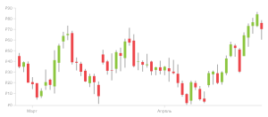
---

#### **1.2 График плотности**  
- **Описание:** Показывает распределение данных через сглаженную кривую.  
- **Использование программистами:**  
  - Анализ плотности распределения (например, время отклика API, возраст пользователей).  
- **Особенности:**  
  - Чувствителен к выбору параметра сглаживания (bandwidth).  
- **Рекомендации:**  
  - **Seaborn** (Python) для автоматического построения, **ggplot2** (R) для кастомных настроек.  
  - Используйте цветовые градиенты для выделения пиков .  
- **Доп. материалы:**  
  - [График плотности](https://datavizcatalogue.com/RU/metody/grafik_plotnosti.html).  
  - Статья: [«Визуализация распределений в Python» на Habr](https://habr.com/ru/companies/skillfactory/articles/683738/) .  
- **Изображение визуализации**  
 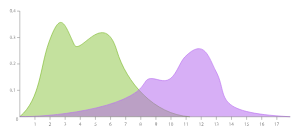
---

#### **1.3 График баров (OHLC, Open-High-Low-Close)**  
- **Описание:** Альтернатива свечному графику с вертикальными линиями для отображения цен.  
- **Использование программистами:**  
  - Финансовые приложения, анализ исторических данных.  
- **Рекомендации:**  
  - **Matplotlib** (Python) для статических графиков, **Highcharts** (JavaScript) для веба.  
  - Добавьте легенду для пояснения цветов линий .  
- **Доп. материалы:**  
  - [График баров](https://datavizcatalogue.com/RU/metody/grafik_barov_ohlc.html).  
  - Пример: [Реализация OHLC на Plotly](https://plotly.com/python/ohlc-charts/).  
- **Изображение визуализации**  
 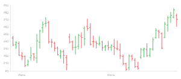
---

#### **1.4 Линейный график**  
- **Описание:** Отображает зависимость данных между двумя переменными.  
- **Использование программистами:**  
  - Мониторинг временных рядов (загрузка сервера, активность пользователей).  
- **Рекомендации:**  
  - **D3.js** для кастомных решений, **Plotly** для интерактивности.  
  - Избегайте наложения более 5 линий для сохранения читаемости .  
- **Доп. материалы:**  
  - [Линейный график](https://datavizcatalogue.com/RU/metody/linejnyj_grafik.html).    
- **Изображение визуализации**  
 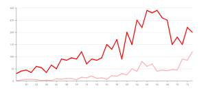
---

#### **1.5 График Каги**  
- **Описание:** Фильтрует «шум» данных, акцентируя значимые изменения.  
- **Использование программистами:**  
  - Анализ долгосрочных трендов (например, цены акций).  
- **Рекомендации:**  
  - Реализация через кастомные скрипты на Python/R.  
  - Используйте библиотеку **pandas** для обработки данных .  
- **Доп. материалы:**  
  - [График Каги](https://datavizcatalogue.com/RU/metody/grafik_kagi.html).    
- **Изображение визуализации**  
 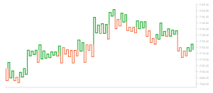
---

#### **1.6 График «крестики-нолики»**  
- **Описание:** Фиксирует изменение цены без учета времени.  
- **Использование программистами:**  
  - Выявление уровней поддержки/сопротивления в трейдинге.  
- **Рекомендации:**  
  - **Pandas** для обработки данных, **Plotly** для визуализации.  
  - Добавьте параметр минимального изменения цены для фильтрации шума .  
- **Доп. материалы:**  
  - [График «крестики-нолики»](https://datavizcatalogue.com/RU/metody/grafik_krestiki_noliki.html).    
- **Изображение визуализации**  
 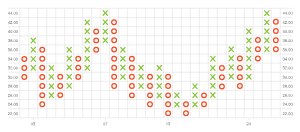
---

#### **1.7 Скрипичный график**  
- **Описание:** Комбинирует гистограмму и график плотности.  
- **Использование программистами:**  
  - Сравнение распределений между категориями (например, доходы по регионам).  
- **Рекомендации:**  
  - **Seaborn** (Python) для автоматического построения, **Plotly** для интерактивности.  
  - Используйте цветовые палитры для разделения категорий .  
- **Доп. материалы:**  
  - [Скрипичный график](https://datavizcatalogue.com/RU/metody/skripicnyj_grafik.html).  
  - Пример: [Violin Plot Tutorial](https://seaborn.pydata.org/examples/grouped_violinplots.html).  
- **Изображение визуализации**  
 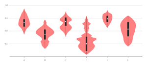
---

#### **1.8 Спиральный график**  
- **Описание:** Отображает данные в виде спирали с временной осью по кругу.  
- **Использование программистами:**  
  - Анализ циклических данных (например, активность по часам).  
- **Рекомендации:**  
  - Кастомные решения на **D3.js** или **Plotly**.  
  - Добавьте анимацию для демонстрации временных изменений .  
- **Доп. материалы:**  
  - [Спиральный график](https://datavizcatalogue.com/RU/metody/spiralnyj_grafik.html).  
  - Пример: [Spiral Visualization with D3.js](https://observablehq.com/@d3/spiral-chart).  
- **Изображение визуализации**  
 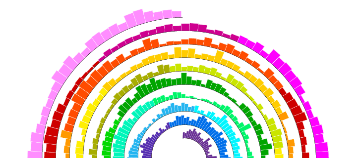
---

#### **1.9 Потоковый график**  
- **Описание:** Визуализирует изменение долей данных во времени.  
- **Использование программистами:**  
  - Анализ структуры данных (например, распределение трафика по источникам).  
- **Рекомендации:**  
  - **Plotly** для интерактивных графиков, **Highcharts** для статических.  
  - Используйте прозрачность для наложения областей .  
- **Доп. материалы:**  
  - [Потоковый график](https://datavizcatalogue.com/RU/metody/potokovyj_grafik.html).    
- **Изображение визуализации**  
 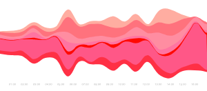
---

### **2. Диаграммы**  
#### **2.1 Дуговая диаграмма**  
- **Описание:** Отображает связи между элементами в виде дуг.  
- **Использование программистами:**  
  - Визуализация сетевых данных (социальные графы, зависимости в коде).  
- **Рекомендации:**  
  - **D3.js** для кастомной реализации, **NetworkX** (Python) для анализа графов.  
  - Избегайте перегрузки: ограничьте число связей до 50 .  
- **Доп. материалы:**  
  - [Дуговая диаграмма](https://datavizcatalogue.com/RU/metody/dugovaja_diagramma.html).  
  - Пример: [Arc Diagram in D3.js](https://observablehq.com/@d3/arc-diagram).  
- **Изображение визуализации**  
 
---

#### **2.2 Диаграмма с областями**  
- **Описание:** Закрашенная область под линией для отображения накопленных данных.  
- **Использование программистами:**  
  - Визуализация общего дохода по месяцам, трафика сайта.  
- **Рекомендации:**  
  - **Highcharts** для веба, **Matplotlib** для статических отчетов.  
  - Используйте разные цвета для каждой категории .  
- **Доп. материалы:**  
  - [Диаграмма с областями](https://datavizcatalogue.com/RU/metody/diagramma_s_oblastjami.html).  
- **Изображение визуализации**  
 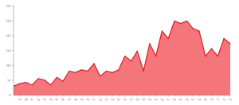
---

#### **2.3 Столбиковая диаграмма**  
- **Описание:** Сравнивает категории через высоту столбцов.  
- **Использование программистами:**  
  - Сравнение метрик (например, количество ошибок по модулям).  
- **Рекомендации:**  
  - **Chart.js** для простых решений, **Plotly** для 3D-визуализации.  
  - Добавьте подписи значений над столбцами .  
- **Доп. материалы:**  
  - [Столбиковая диаграмма](https://datavizcatalogue.com/RU/metody/stolbikovaja_diagramma.html).   
- **Изображение визуализации**  
 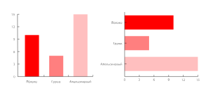
---

#### **2.4 Диаграмма размаха («ящик с усами»)**  
- **Описание:** Показывает медиану, квартили и выбросы.  
- **Использование программистами:**  
  - Анализ распределения данных (например, время выполнения запросов).  
- **Рекомендации:**  
  - **Seaborn** (Python) для автоматического построения, **Plotly** для интерактивности.  
  - Используйте горизонтальную ориентацию для сравнения множества категорий .  
- **Доп. материалы:**  
  - [Диаграмма размаха](https://datavizcatalogue.com/RU/metody/diagramma_razmaha.html).  
- **Изображение визуализации**  
 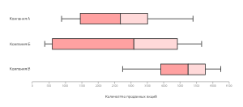
---

#### **2.5 Пузырьковая диаграмма**  
- **Описание:** Отображает три переменные через координаты X, Y и размер пузырька.  
- **Использование программистами:**  
  - Анализ многомерных данных (например, доход, расход, прибыль).  
- **Рекомендации:**  
  - **D3.js** для кастомных решений, **Plotly** для анимации.  
  - Нормализуйте размер пузырьков для избежания искажений .  
- **Доп. материалы:**  
  - [Пузырьковая диаграмма](https://datavizcatalogue.com/RU/metody/puzyrkovaja_diagramma.html).  
  - Пример: [Bubble Chart with Animation](https://plotly.com/python/bubble-charts/).  
- **Изображение визуализации**  
 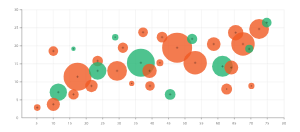
---

#### **2.6 Пулевая диаграмма**  
- **Описание:** Сравнивает фактические значения с целевыми через «пули».  
- **Использование программистами:**  
  - Отслеживание KPI (например, выполнение плана продаж).  
- **Рекомендации:**  
  - **Power BI** для бизнес-аналитики, **Tableau** для визуализации.  
  - Используйте цветовые индикаторы для превышения/недостижения целей .  
- **Доп. материалы:**  
  - Пример: [Bullet Chart Design Guide](https://www.tableau.com/learn/whitepapers/bullet-graph).  
- **Изображение визуализации**  
 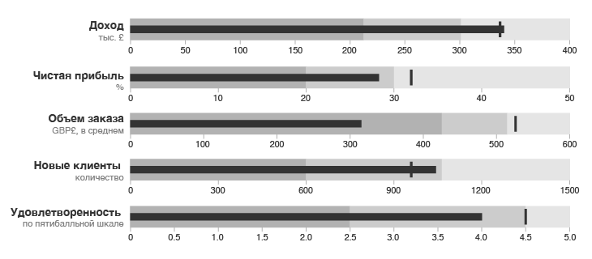
---

#### **2.7 Хордовая диаграмма**  
- **Описание:** Визуализирует взаимосвязи между объектами.  
- **Использование программистами:**  
  - Анализ потоков данных (миграция пользователей).  
- **Рекомендации:**  
  - **D3.js** для интерактивных решений, **Python NetworkX** для статических.  
  - Избегайте перегрузки: ограничьте число узлов до 20 .  
- **Доп. материалы:**  
  - [Хордовая диаграмма](https://datavizcatalogue.com/RU/metody/hordovaja_diagramma.html).  
  - Пример: [Chord Diagram Tutorial](https://www.data-to-viz.com/graph/chord.html).  
- **Изображение визуализации**  
 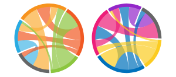
---

#### **2.8 Кольцевая диаграмма**  
- **Описание:** Аналог круговой диаграммы с вырезанным центром.  
- **Использование программистами:**  
  - Отображение долей (например, распределение ресурсов).  
- **Рекомендации:**  
  - **Chart.js** для веба, **Matplotlib** для статических отчетов.  
  - Используйте подписи внутри секторов для наглядности .  
- **Доп. материалы:**  
  - [Кольцевая диаграмма](https://datavizcatalogue.com/RU/metody/kolcevaja_diagramma.html).   
- **Изображение визуализации**  
 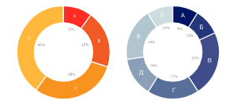
---

#### **2.9 Гистограмма**  
- **Описание:** Показывает распределение данных по интервалам.  
- **Использование программистами:**  
  - Анализ частотности событий (например, время ответа сервера).  
- **Рекомендации:**  
  - **Seaborn** для автоматического подбора бинов, **Excel** для быстрых отчетов.  
  - Используйте прозрачные столбцы для наложения распределений .  
- **Доп. материалы:**  
  - [Гистограмма](https://datavizcatalogue.com/RU/metody/gistogramma.html).  
- **Изображение визуализации**  
 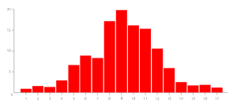
---

#### **2.10 Диаграмма Маримекко**  
- **Описание:** Комбинирует столбцы разной ширины и высоты.  
- **Использование программистами:**  
  - Анализ двумерных данных (продажи по регионам и категориям).  
- **Рекомендации:**  
  - **D3.js** для кастомной реализации, **Tableau** для готовых решений.  
  - Добавьте легенду для пояснения цветов и размеров .  
- **Доп. материалы:**  
  - [Диаграмма Маримекко](https://datavizcatalogue.com/RU/metody/diagramma_marimekko.html).  
  - Пример: [Marimekko Chart in D3.js](https://observablehq.com/@d3/marimekko-chart).  
- **Изображение визуализации**  
 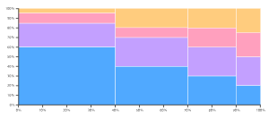
---

#### **2.11 Столбиковая диаграмма с группировкой**  
- **Описание:** Сравнивает подкатегории внутри категорий.  
- **Использование программистами:**  
  - Анализ данных с вложенными категориями.  
- **Рекомендации:**  
  - **Plotly** для интерактивности, **Excel** для простых задач.  
  - Используйте разные цвета для каждой подкатегории .  
- **Доп. материалы:**  
  - [Столбиковая диаграмма с группировкой](https://datavizcatalogue.com/RU/metody/stolbikovaja_diagramma_s_gruppirovkoj.html).   
- **Изображение визуализации**  
 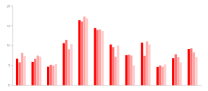
---

#### **2.12 Сетевая диаграмма**  
- **Описание:** Визуализирует связи в сетевых структурах.  
- **Использование программистами:**  
  - Анализ графов (социальные сети, зависимости в коде).  
- **Рекомендации:**  
  - **NetworkX** (Python) для анализа, **Gephi** для визуализации.  
  - Используйте алгоритмы размещения узлов (например, ForceAtlas2) .  
- **Доп. материалы:**  
  - [Сетевая диаграмма](https://datavizcatalogue.com/RU/metody/setevaja_diagramma.html).  
  - Пример: [Network Graph Tutorial](https://gephi.org/users/tutorial-visualization/).  
- **Изображение визуализации**  
 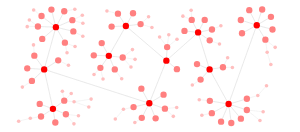
---

#### **2.13 Диаграмма «роза Найтингейл»**  
- **Описание:** Отображает данные в виде лепестков разного размера и угла.  
- **Использование программистами:**  
  - Визуализация циклических данных (например, активность по часам).  
- **Рекомендации:**  
  - **Python Matplotlib** для построения, **D3.js** для интерактивности.  
  - Используйте радиальные оси для точного отображения углов .  
- **Доп. материалы:**  
  - [Диаграмма «роза Найтингейл»](https://datavizcatalogue.com/RU/metody/diagramma_roza_najtingejl.html).  
  - Пример: [Polar Chart in Python](https://matplotlib.org/stable/gallery/pie_and_polar_charts/polar_bar.html).  
- **Изображение визуализации**  
 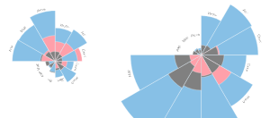
---

#### **2.14 Неленточная хордовая диаграмма**  
- **Описание:** Упрощенная версия хоровой диаграммы без лент.  
- **Использование программистами:**  
  - Визуализация связей в компактном формате.  
- **Рекомендации:**  
  - **D3.js** для реализации, **Python Plotly** для статических версий.  
  - Ограничьте число узлов до 10 для читаемости .  
- **Доп. материалы:**  
  - [Неленточная хордовая диаграмма](https://datavizcatalogue.com/RU/metody/nelentocnaja_hordovaja_diagramma.html).  
  - Пример: [Chord Diagram without Ribbons](https://observablehq.com/@d3/chord-diagram).  
- **Изображение визуализации**  
 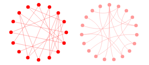
---

#### **2.15 Диаграмма с параллельными координатами**  
- **Описание:** Отображает многомерные данные через параллельные оси.  
- **Использование программистами:**  
  - Анализ взаимосвязей между множеством переменных.  
- **Рекомендации:**  
  - **Plotly** для интерактивности, **Python Pandas** для обработки данных.  
  - Нормализуйте данные для сравнения шкал .  
- **Доп. материалы:**  
  - [Диаграмма с параллельными координатами](https://datavizcatalogue.com/RU/metody/diagramma_s_parallelnymi_koordinatami.html).  
  - Пример: [Parallel Coordinates in D3.js](https://observablehq.com/@d3/parallel-coordinates).  
- **Изображение визуализации**  
 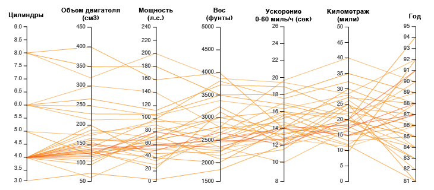
---

#### **2.16 Пиктографическая диаграмма**  
- **Описание:** Использует иконки для представления данных.  
- **Использование программистами:**  
  - Визуализация данных для неспециалистов (например, инфографика).  
- **Рекомендации:**  
  - **Canva** для дизайна, **Tableau** для интеграции с аналитикой.  
  - Используйте единый стиль иконок .  
- **Доп. материалы:**  
  - [Пиктографическая диаграмма](https://datavizcatalogue.com/RU/metody/piktograficeskaja_diagramma.html).  
- **Изображение визуализации**  
 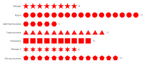
---

#### **2.17 Круговая диаграмма**  
- **Описание:** Показывает доли данных в виде секторов круга.  
- **Использование программистами:**  
  - Отображение процентного соотношения (например, распределение трафика).  
- **Рекомендации:**  
  - **Chart.js** для веба, **Excel** для быстрых отчетов.  
  - Ограничьте число секторов до 5–7 для читаемости .  
- **Доп. материалы:**  
  - [Круговая диаграмма](https://datavizcatalogue.com/RU/metody/krugovaja_diagramma.html).  
- **Изображение визуализации**  
 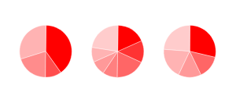
---

#### **2.18 Диаграмма с пропорциональными областями**  
- **Описание:** Размер области соответствует значению данных.  
- **Использование программистами:**  
  - Сравнение величин через площадь (например, население стран).  
- **Рекомендации:**  
  - **D3.js** для кастомных решений, **Tableau** для автоматизации.  
  - Используйте логарифмическую шкалу для больших диапазонов .  
- **Доп. материалы:**  
  - [Диаграмма с пропорциональными областями](https://datavizcatalogue.com/RU/metody/diagramma_s_proporcionalnymi_oblastjami.html).  
  - Пример: [Bubble Map in D3.js](https://observablehq.com/@d3/bubble-map).  
- **Изображение визуализации**  
 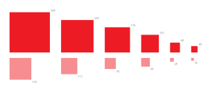
---

#### **2.19 Радиальная диаграмма**  
- **Описание:** Отображает данные в полярной системе координат.  
- **Использование программистами:**  
  - Визуализация циклических данных (например, активность по дням недели).  
- **Рекомендации:**  
  - **Plotly** для интерактивности, **Matplotlib** для статических графиков.  
  - Добавьте сетку для улучшения точности восприятия .  
- **Доп. материалы:**  
  - [Радиальная диаграмма](https://datavizcatalogue.com/RU/metody/radialnaja_diagramma.html).  
  - Пример: [Radial Bar Chart in Python](https://plotly.com/python/wind-rose-charts/).  
- **Изображение визуализации**  
 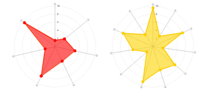
---

#### **2.20 Радиальная полосчатая диаграмма**  
- **Описание:** Полосы расположены по кругу.  
- **Использование программистами:**  
  - Сравнение категорий в компактном формате.  
- **Рекомендации:**  
  - **D3.js** для кастомных решений, **Excel** для простых задач.  
  - Используйте цветовые коды для категорий .  
- **Доп. материалы:**  
  - [Радиальная полосчатая диаграмма](https://datavizcatalogue.com/RU/metody/radialnaja_poloscataja_diagramma.html).    
- **Изображение визуализации**  
 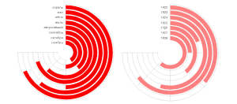
---

#### **2.21 Радиальная столбчатая диаграмма**  
- **Описание:** Столбцы расположены по кругу.  
- **Использование программистами:**  
  - Визуализация данных с циклической природой.  
- **Рекомендации:**  
  - **Highcharts** для веба, **Python Matplotlib** для статических графиков.  
  - Избегайте перекрытия столбцов .  
- **Доп. материалы:**  
  - [Радиальная столбчатая диаграмма](https://datavizcatalogue.com/RU/metody/radialnaja_stolbcataja_diagramma.html).  
- **Изображение визуализации**  
 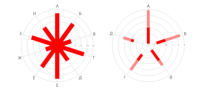
---

#### **2.22 Диаграмма рассеяния**  
- **Описание:** Отображает взаимосвязь двух переменных через точки.  
- **Использование программистами:**  
  - Поиск корреляций (например, зависимость дохода от возраста).  
- **Рекомендации:**  
  - **Seaborn** для автоматической регрессии, **Plotly** для 3D-рассеяния.  
  - Добавьте линию тренда для визуализации тренда .  
- **Доп. материалы:**  
  - [Диаграмма рассеяния](https://datavizcatalogue.com/RU/metody/diagramma_rassejanija.html).  
  - Пример: [Scatterplot Matrix in Python](https://seaborn.pydata.org/examples/scatterplot_matrix.html).  
- **Изображение визуализации**  
 
---

#### **2.23 Диаграмма диапазонов**  
- **Описание:** Показывает минимальные и максимальные значения в данных.  
- **Использование программистами:**  
  - Анализ волатильности (например, температура за месяц).  
- **Рекомендации:**  
  - **Highcharts** для интерактивности, **Excel** для статических отчетов.  
  - Используйте заливку между линиями для наглядности .  
- **Доп. материалы:**  
  - [Диаграмма диапазонов](https://datavizcatalogue.com/RU/metody/diagramma_diapazonov.html).  
  - Пример: [Range Area Chart](https://www.highcharts.com/demo/arearange-line).  
- **Изображение визуализации**  
 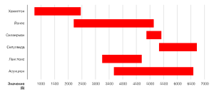
---

#### **2.24 Облако слов**  
- **Описание:** Визуализирует частоту слов через размер шрифта.  
- **Использование программистами:**  
  - Анализ текстовых данных (например, отзывы пользователей).  
- **Рекомендации:**  
  - **WordCloud** (Python) для генерации, **Tableau** для интеграции с аналитикой.  
  - Фильтруйте стоп-слова для повышения информативности .  
- **Доп. материалы:**  
  - [Облако слов](https://datavizcatalogue.com/RU/metody/oblako_slov.html).  
  - Пример: [Word Cloud in Python](https://github.com/amueller/word_cloud).  
- **Изображение визуализации**  
 
---

#### **2.25 Накопительная диаграмма с областями**  
- **Описание:** Показывает накопление данных по категориям.  
- **Использование программистами:**  
  - Анализ структуры данных во времени.  
- **Рекомендации:**  
  - **Plotly** для интерактивности, **Excel** для статических отчетов.  
  - Используйте прозрачность для наложения областей .  
- **Доп. материалы:**  
  - [Накопительная диаграмма с областями](https://datavizcatalogue.com/RU/metody/nakopitel_naja_diagramma_s_oblastjami.html).  
  - Пример: [Stacked Area Chart in D3.js](https://observablehq.com/@d3/stacked-area-chart).  
- **Изображение визуализации**  
 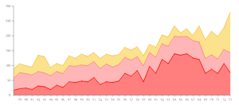
---

#### **2.26 Диаграмма «стебель-листья»**  
- **Описание:** Отображает распределение данных через цифры.  
- **Использование программистами:**  
  - Быстрый анализ небольших наборов данных.  
- **Рекомендации:**  
  - **Pandas** (Python) для обработки данных, кастомные скрипты.  
  - Используйте сортировку для упрощения восприятия .  
- **Доп. материалы:**  
  - [Диаграмма «стебель-листья»](https://datavizcatalogue.com/RU/metody/diagramma_stebel_listja.html).   
- **Изображение визуализации**  
 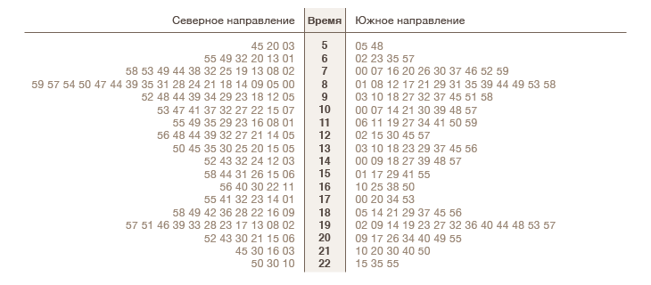
---

#### **2.27 Диаграмма «Солнечные лучи»**  
- **Описание:** Визуализирует иерархию данных в виде лучей.  
- **Использование программистами:**  
  - Анализ древовидных структур (например, файловая система).  
- **Рекомендации:**  
  - **D3.js** для реализации, **Python Plotly** для простых задач.  
  - Ограничьте глубину иерархии для читаемости .  
- **Доп. материалы:**  
  - [Диаграмма «Солнечные лучи»](https://datavizcatalogue.com/RU/metody/diagramma_solnecnye_luci.html).  
  - Пример: [Sunburst Chart in D3.js](https://observablehq.com/@d3/sunburst).  
- **Изображение визуализации**  
 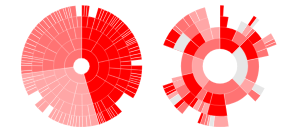
---

#### **2.28 Диаграмма Венна**  
- **Описание:** Показывает пересечения множеств через перекрывающиеся круги.  
- **Использование программистами:**  
  - Анализ пересечений данных (например, аудитория в соцсетях).  
- **Рекомендации:**  
  - **Matplotlib** для статических диаграмм, **Venn.js** для веба.  
  - Используйте прозрачность для визуализации перекрытий .  
- **Доп. материалы:**  
  - [Диаграмма Венна](https://datavizcatalogue.com/RU/metody/diagramma_venna.html).  
  - Пример: [Venn Diagram in Python](https://pypi.org/project/matplotlib-venn/).  
- **Изображение визуализации**  
 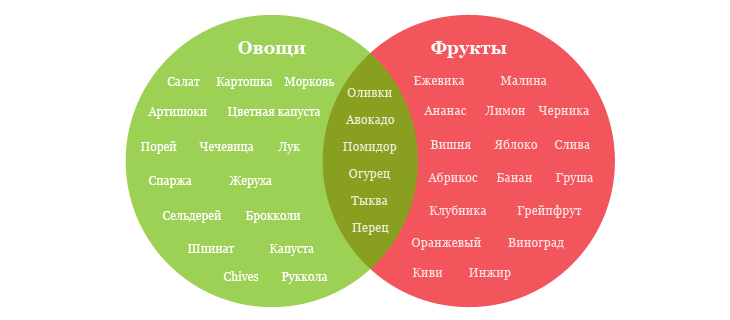
---

### **3. Шкала времени (диаграммы времени)**  
#### **3.1 Диаграмма Ганта**  
- **Описание:** Визуализирует этапы проекта и сроки.  
- **Использование программистами:**  
  - Управление задачами в Agile, трекинг дедлайнов.  
- **Рекомендации:**  
  - **Jira** для интеграции с задачами, **Microsoft Project** для сложных проектов.  
  - Добавьте зависимости между задачами .  
- **Доп. материалы:**  
  - [Диаграмма Ганта](https://datavizcatalogue.com/RU/metody/diagramma_ganta.html).   
- **Изображение визуализации**  
 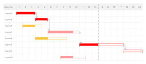
---

#### **3.2 Хронологическая шкала**  
- **Описание:** Отображает события в хронологическом порядке.  
- **Использование программистами:**  
  - Визуализация истории версий ПО, логов изменений.  
- **Рекомендации:**  
  - **Timeline.js** для веба, **Excel** для простых задач.  
  - Используйте интерактивные элементы для детализации .  
- **Доп. материалы:**  
  - [Хронологическая шкала](https://datavizcatalogue.com/RU/metody/hronologiceskaja_skala.html).  
  - Пример: [Timeline in D3.js](https://observablehq.com/@d3/timeline).  
- **Изображение визуализации**  
 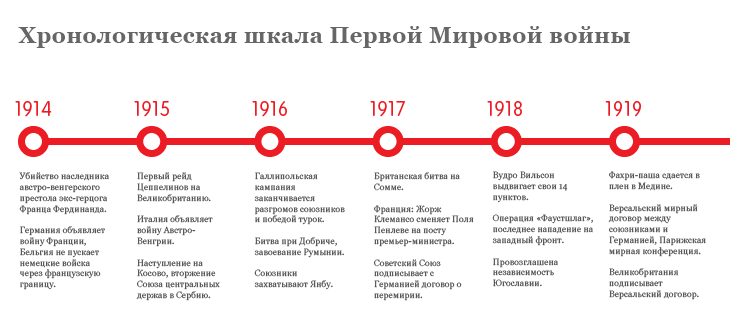
---

### **4. Блок-схемы (диаграммы визуализации процесса)**  
#### **4.1 Блок-схема**  
- **Описание:** Визуализирует алгоритмы или процессы.  
- **Использование программистами:**  
  - Проектирование логики приложений, документирование рабочих процессов.  
- **Рекомендации:**  
  - **Draw.io** для простых схем, **Lucidchart** для командной работы.  
  - Используйте стандартные символы (ромбы для решений, прямоугольники для действий) .  
- **Доп. материалы:**  
  - [Блок-схема](https://datavizcatalogue.com/RU/metody/blok_shema.html).   
- **Изображение визуализации**  
 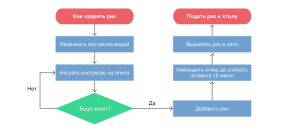
---

#### **4.2 Диаграмма Санкея**  
- **Описание:** Отображает потоки данных между узлами.  
- **Использование программистами:**  
  - Анализ перемещения ресурсов (например, трафик сайта).  
- **Рекомендации:**  
  - **D3.js** для кастомных решений, **Tableau** для готовых шаблонов.  
  - Используйте цветовые коды для разных типов потоков .  
- **Доп. материалы:**  
  - [Диаграмма Санкея](https://datavizcatalogue.com/RU/metody/diagramma_sankeja.html).  
  - Пример: [Sankey Diagram in D3.js](https://observablehq.com/@d3/sankey-diagram).  
- **Изображение визуализации**  
 
---

#### **4.3 Мозговой штурм**  
- **Описание:** Визуализирует идеи и их связи.  
- **Использование программистами:**  
  - Планирование архитектуры проекта, генерация идей.  
- **Рекомендации:**  
  - **Miro** для совместной работы, **XMind** для структурирования.  
  - Добавьте метки и комментарии к узлам .  
- **Доп. материалы:**  
  - [Мозговой штурм](https://datavizcatalogue.com/RU/metody/mozgovoj_sturm.html).   
- **Изображение визуализации**  
 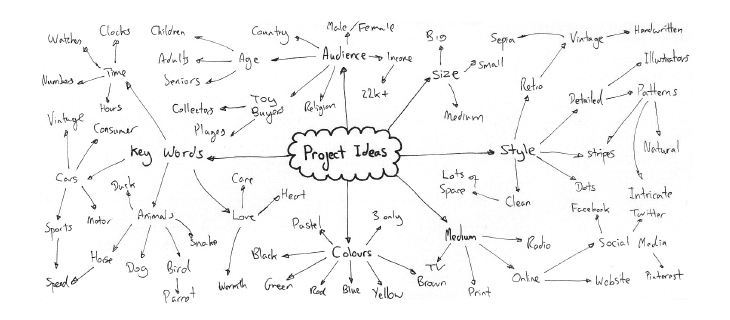
---

#### **4.4 Древовидная диаграмма**  
- **Описание:** Отображает иерархические данные в виде дерева.  
- **Использование программистами:**  
  - Визуализация структуры каталогов, зависимостей в коде.  
- **Рекомендации:**  
  - **D3.js** для интерактивности, **Treemap** для компактного отображения.  
  - Используйте раскрывающиеся узлы для детализации .  
- **Доп. материалы:**  
  - [Древовидная диаграмма](https://datavizcatalogue.com/RU/metody/drevovidnaja_diagramma.html).  
  - Пример: [Tree Diagram in Python](https://plotly.com/python/tree-plots/).  
- **Изображение визуализации**  
 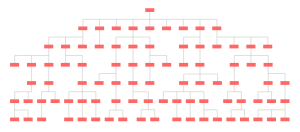
---

### **5. Матрицы**  
#### **5.1 Календарь**  
- **Описание:** Визуализирует данные в формате календаря.  
- **Использование программистами:**  
  - Отслеживание активностей по дням (например, коммиты в Git).  
- **Рекомендации:**  
  - **FullCalendar.js** для веба, **Heatmap.js** для цветового кодирования.  
  - Добавьте всплывающие подсказки для деталей .  
- **Доп. материалы:**  
  - [Календарь](https://datavizcatalogue.com/RU/metody/kalendar.html).   
- **Изображение визуализации**  
 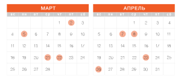
---

#### **5.2 Точечная матричная диаграмма**  
- **Описание:** Отображает данные в виде матрицы точек.  
- **Использование программистами:**  
  - Анализ корреляций между категориями.  
- **Рекомендации:**  
  - **Seaborn** (Python) для визуализации, **Excel** для простых задач.  
  - Используйте размер точек для третьей переменной .  
- **Доп. материалы:**  
  - [Точечная матричная диаграмма](https://datavizcatalogue.com/RU/metody/tocecnaja_matricnaja_diagramma.html).  
  - Пример: [Scatterplot Matrix in Seaborn](https://seaborn.pydata.org/examples/scatterplot_matrix.html).  
- **Изображение визуализации**  
 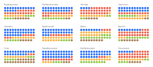
---

#### **5.3 Тепловая карта (матрица)**  
- **Описание:** Цветовая интенсивность отражает значение данных.  
- **Использование программистами:**  
  - Анализ активностей пользователей (например, heatmap кликов).  
- **Рекомендации:**  
  - **Seaborn** (Python) для статических карт, **D3.js** для интерактивности.  
  - Нормализуйте данные для точной цветовой интерпретации .  
- **Доп. материалы:**  
  - [Тепловая карта](https://datavizcatalogue.com/RU/metody/teplovaja_karta.html).  
  - Пример: [Heatmap in D3.js](https://observablehq.com/@d3/heatmap).  
- **Изображение визуализации**  
 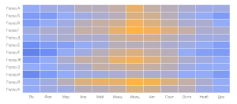
---

#### **5.4 Древовидная карта**  
- **Описание:** Визуализирует иерархические данные через вложенные прямоугольники.  
- **Использование программистами:**  
  - Анализ структуры данных (например, размер файлов).  
- **Рекомендации:**  
  - **D3.js** для кастомных решений, **Treemap** для автоматизации.  
  - Используйте цвет для обозначения категорий, размер — для значений .  
- **Доп. материалы:**  
  - [Древовидная карта](https://datavizcatalogue.com/RU/metody/drevovidnaja_karta.html).  
  - Пример: [Treemap in Python](https://plotly.com/python/treemaps/).  
- **Изображение визуализации**  
 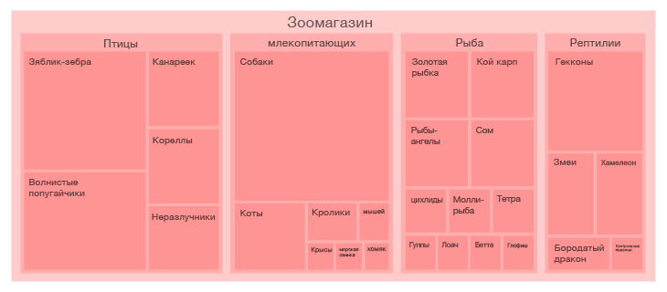
---

#### **5.5 Расписание**  
- **Описание:** Отображает данные в формате расписания.  
- **Использование программистами:**  
  - Планирование задач (например, расписание деплоев).  
- **Рекомендации:**  
  - **FullCalendar.js** для веба, **Google Calendar API** для интеграции.  
  - Добавьте фильтры для категорий задач .  
- **Доп. материалы:**  
  - [Расписание](https://datavizcatalogue.com/RU/metody/raspisanie.html).  
- **Изображение визуализации**  
 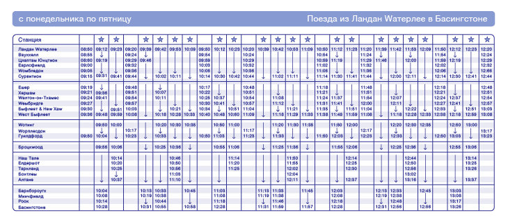
---

### **6. Карты и картограммы**  
#### **6.1 Пузырьковая карта**  
- **Описание:** Совмещает географию с размерами пузырьков.  
- **Использование программистами:**  
  - Визуализация данных по регионам (например, ВВП).  
- **Рекомендации:**  
  - **Leaflet.js** + **GeoJSON** для веба, **Tableau** для аналитики.  
  - Используйте анимацию для динамических данных .  
- **Доп. материалы:**  
  - [Пузырьковая карта](https://datavizcatalogue.com/RU/metody/puzyrkovaja_karta.html).  
- **Изображение визуализации**  
 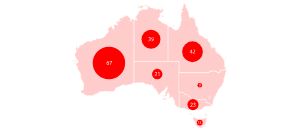
---

#### **6.2 Фоновая картограмма (хороплет)**  
- **Описание:** Закрашивает регионы в зависимости от значения показателя.  
- **Использование программистами:**  
  - Отображение статистики по территориям (например, уровень безработицы).  
- **Рекомендации:**  
  - **D3.js** для кастомных решений, **Tableau** для автоматизации.  
  - Используйте градиентные цвета для плавных переходов .  
- **Доп. материалы:**  
  - [Хороплет](https://datavizcatalogue.com/RU/metody/horoplet.html).  
  - Пример: [Choropleth Map in D3.js](https://observablehq.com/@d3/choropleth).  
- **Изображение визуализации**  
 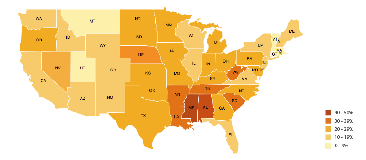
---

#### **6.3 Карта взаимосвязей**  
- **Описание:** Визуализирует связи между географическими точками.  
- **Использование программистами:**  
  - Анализ логистических маршрутов, миграции данных.  
- **Рекомендации:**  
  - **Leaflet.js** для базовых карт, **Mapbox** для кастомного дизайна.  
  - Добавьте интерактивные линии для маршрутов .  
- **Доп. материалы:**  
  - [Карта взаимосвязей](https://datavizcatalogue.com/RU/metody/karta_vzaimosvjazej.html).  
  - Пример: [Connection Map in D3.js](https://observablehq.com/@d3/connection-map).  
- **Изображение визуализации**  
 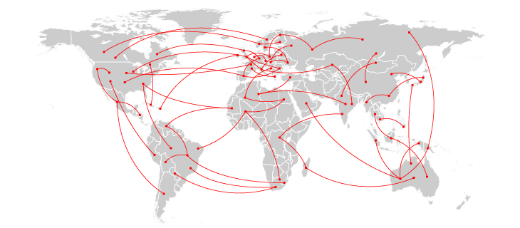
---

#### **6.4 Карта потоков**  
- **Описание:** Отображает перемещение данных или ресурсов.  
- **Использование программистами:**  
  - Визуализация сетевого трафика, логистических потоков.  
- **Рекомендации:**  
  - **D3.js** для анимации потоков, **Power BI** для бизнес-аналитики.  
  - Используйте стрелки для указания направления .  
- **Доп. материалы:**  
  - [Карта потоков](https://datavizcatalogue.com/RU/metody/karta_potokov.html).  
  - Пример: [Flow Map in D3.js](https://observablehq.com/@d3/flow-map).  
- **Изображение визуализации**  
 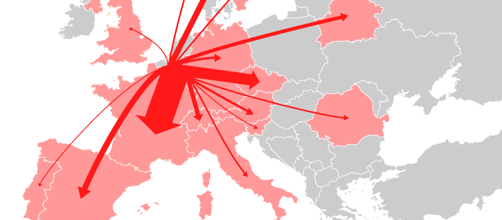
---

#### **6.5 Точечная карта**  
- **Описание:** Отображает данные через точки на карте.  
- **Использование программистами:**  
  - Анализ локаций событий (например, пользовательские активности).  
- **Рекомендации:**  
  - **Google Maps API** для интеграции, **Leaflet.js** для кастомных решений.  
  - Используйте кластеризацию для больших наборов данных .  
- **Доп. материалы:**  
  - [Точечная карта](https://datavizcatalogue.com/RU/metody/tocecnaja_karta.html).   
- **Изображение визуализации**  
 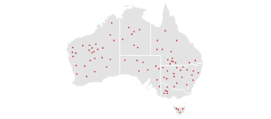
---

#### **6.6 Карта пробок в Москве, «Яндекс»**  
- **Описание:** Визуализирует текущую дорожную ситуацию.  
- **Использование программистами:**  
  - Интеграция данных о пробках в приложения.  
- **Рекомендации:**  
  - **API Яндекс.Карт** для получения данных в реальном времени.  
  - Добавьте слои для отображения альтернативных маршрутов .  
- **Доп. материалы:**  
  - [Карта пробок](https://yandex.ru/maps/213/moscow/probki/?ll=37.622504%2C55.753215&z=10).  
  - Документация: [Яндекс.Карты API](https://yandex.ru/dev/maps/).  
- **Изображение визуализации**  
 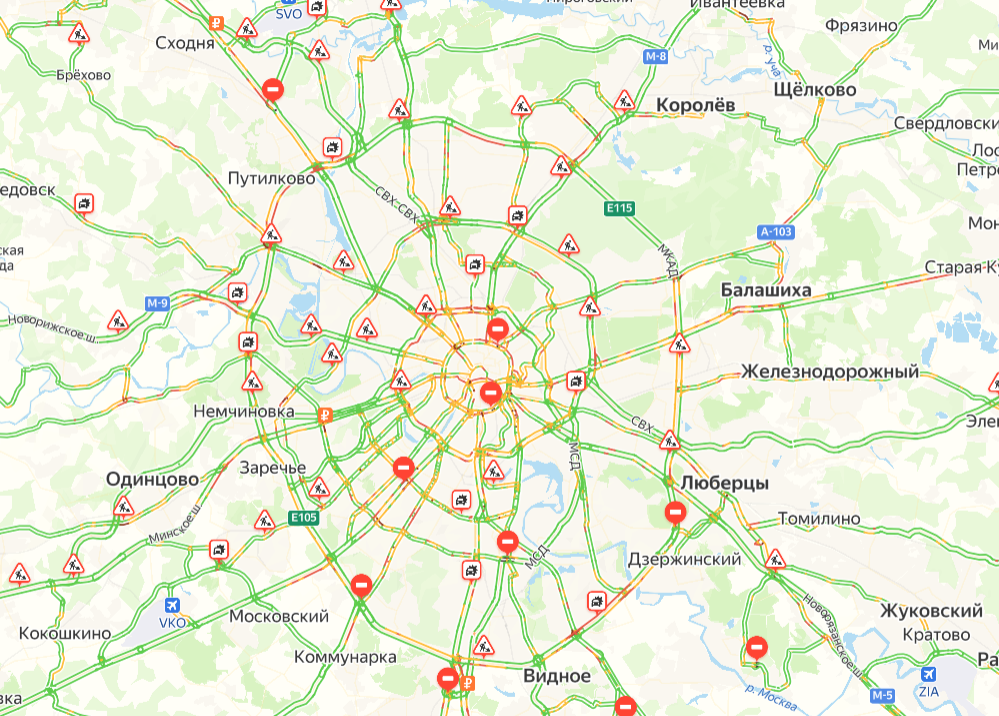