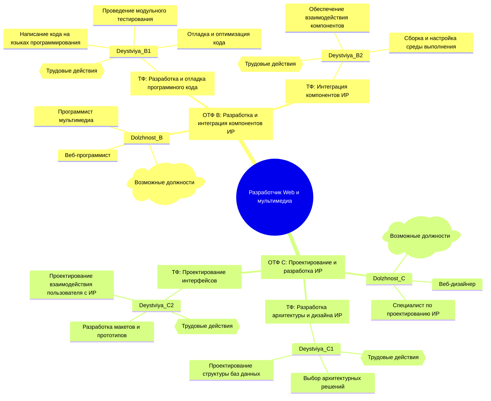
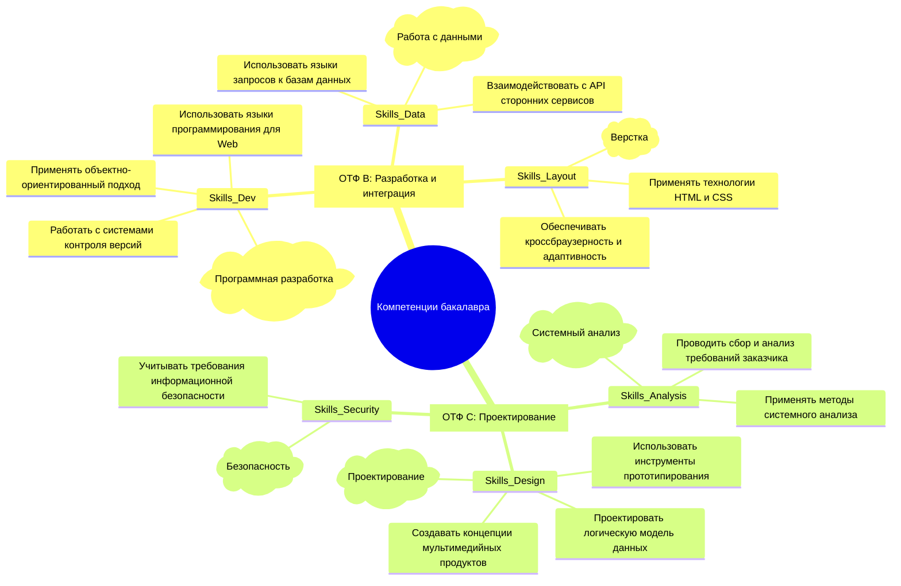

## Гневнов А.Е., ИВТ 2.1
### Лабораторная работа №4

#### 1. Обобщенные трудовые функции (ОТФ) с требованием «высшее образование — бакалавриат»
Согласно стандарту, данному требованию соответствуют функции 6-го квалификационного уровня:

1.  **ОТФ B:** Разработка и интеграция компонентов информационных ресурсов (6 уровень квалификации).
2.  **ОТФ C:** Проектирование и разработка информационных ресурсов (6 уровень квалификации).

#### 2. Интеллект-карта: Связь функций, должностей и действий
Данная карта отображает структуру профессиональной деятельности для уровней, требующих степень бакалавра.

#### 3. Интеллект-карта: Связь функций и необходимых компетенций (умений)
Карта фокусируется на практических навыках (Necessary Skills), требуемых для выполнения функций уровня бакалавриата.

