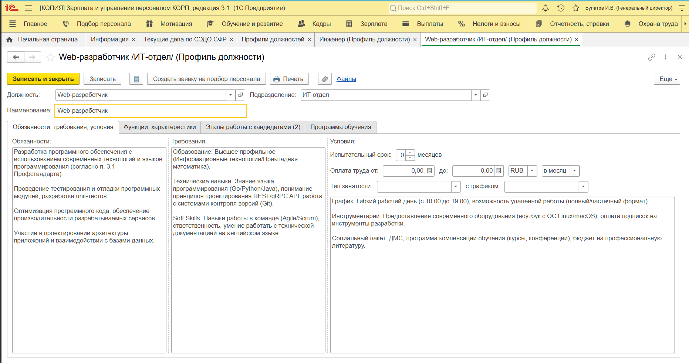
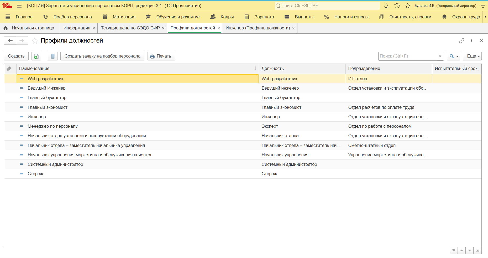

# Гневнов А.Е., ИВТ 2.1
## Лабораторные работы 3-4
### 4.1. Сравнительный анализ «1С:ЗУП 8 ПРОФ» и «1С:ЗУП 8 КОРП»

| Критерий сравнения | 1С:Зарплата и управление персоналом 8 ПРОФ | 1С:Зарплата и управление персоналом 8 КОРП |
| :--- | :--- | :--- |
| **Целевая аудитория** | Компании среднего и малого бизнеса с типовыми кадровыми процессами. | Крупные предприятия и холдинги, требующие автоматизации сложных HR-процессов. |
| **Расчет зарплаты и кадровый учет** | Полный функционал: расчет ЗП, отпуска, больничные, отчетность в ФНС/СФР. | Весь функционал ПРОФ + расширенная аналитика и учет по сложной структуре юрлиц. |
| **Подбор персонала** | Базовый: учет кандидатов, хранение резюме. | Полный цикл: интеграция с работными сайтами, воронка найма, оценка кандидатов. |
| **Обучение и развитие** | Не предусмотрено. | Автоматизация обучения, создание курсов, тестов, планов развития (LMS). |
| **Оценка персонала** | Не предусмотрено. | Оценка 360 градусов, KPI, грейдирование, матрица компетенций. |
| **Самообслуживание сотрудников** | Не предусмотрено. | Личный кабинет сотрудника (заказ справок, отпусков, расчетные листы). |
| **Охрана труда** | Базовый учет. | Углубленный учет: медосмотры, инструктажи, спецоценка условий труда (СОУТ). |
| **Ценовая политика** | Оптимальное решение для типовых задач учета. | Выше за счет дополнительных модулей управления талантами (HCM). |

**Краткое резюме для вывода в отчете:**
«1С:ЗУП 8 ПРОФ» является надежным инструментом для автоматизации рутинного учета зарплаты и кадров. «1С:ЗУП 8 КОРП» — это полноценная HCM-система (Human Capital Management), которая превращает HR-департамент из «расчетного центра» в стратегическое подразделение за счет автоматизации процессов найма, обучения, оценки и вовлеченности сотрудников.

### 4.2–4.3. Создание профиля должности «Web-разработчик»

  
Создание профиля должности должности «Web-разработчик» 

 Созданный профиль должности «Web-разработчик»