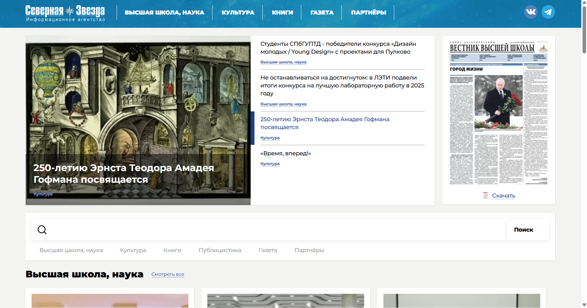

# Название, год создания.
ООО "ИНФОРМАЦИОННОЕ АГЕНТСТВО "СЕВЕРНАЯ ЗВЕЗДА", 2008
# Скриншот сайта.

# Цель и задачи агентства.
качественного освещения актуальных событий, происходящих в сфере высшего образования, науки, культуры и искусства
# Основные направления деятельности.
освещения актуальных событий, происходящих в сфере высшего образования, науки, культуры и искусства
# Основные тематические направления (информационное, официальное, спортивное, и т.п.)
Культура, образование
# Возрастные ограничения.
16+
# Управление (редактор, редакционная коллегия)
Директор, главный редактор сетевого издания
Татьяна Валерьевна Попова
Помощник директора по вопросам культурно-образовательной деятельности
Мария Александровна Чурсинова
Руководитель проектов
Марина Леонидовна Цеханович
# Орган, зарегистрировавший СМИ, и регистрационный номер.
Федеральной службе по надзору в сфере связи, информационных технологий и массовых коммуникаций (Роскомнадзор)
Номер свидетельства о регистрации: ЭЛ №ФС 77-70968
# Структура агентства или его сайта.
«СЕВЕРНАЯ ЗВЕЗДА» создано на базе одноименного издательства, периодические издания которого «Санкт-Петербургский Вестник высшей школы» и «Санкт-Петербургский Музыкальный вестник»
# Из каких источников агентство получает информацию.
получает информацию благодаря партнёрским связям с высшими учебными заведениями и музыкальными учреждениями
# Оцените качество информации (актуальная, достоверная, полная и т.д.)
Информация актуальная, достоверная и полная
# Наличие канала yuotube или страницы в социальных сетях.
VK - https://vk.com/north_star_info
TG - https://telegram.me/univer_spb
# URL
https://nstar-spb.ru/
# Общее впечатление (стиль изложения информации, дизайн, интерфейс).
Дизайн и интерфейс смотрятся перегруженными, стиль изложения информации прост для усвоения
# Источники, с которых взята информация об агентстве.
https://nstar-spb.ru/ob-informagentstve-severnaya-zvezda.html
https://www.audit-it.ru/contragent/1089848010020_ooo-informagentstvo-severnaya-zvezda