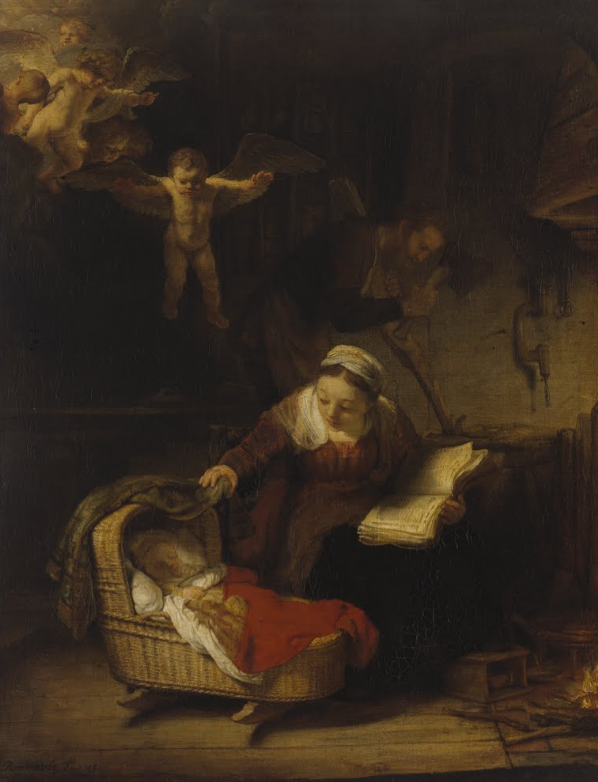

# Гневнов А.Е., ИСР

### Отчет об онлайн-посещении Государственного Эрмитажа

**Экспонат:** Картина «Святое семейство»
**Автор:** Харменс ван Рейн Рембрандт
**Дата создания:** 1645 г.
**Техника:** Холст, масло (91 x 117 см)

#### Описание экспоната
Картина переносит библейский сюжет в обстановку обычного дома голландского плотника XVII века. На заднем плане в полумраке работает Иосиф, а на переднем — Мария отрывается от чтения книги, чтобы поправить полог колыбели и взглянуть на спящего младенца. Композиция наполнена парящими ангелами, один из которых раскинул руки, предвещая будущую судьбу Христа.

#### Личное впечатление
При детальном рассмотрении  больше всего поражает работа со светом. Сильное впечатление производят следующие детали:

1.  **Светотень (кьяроскуро):** Свет исходит не от окна, а словно от самой колыбели и ангелов, выхватывая из темноты лицо Марии. Это создает невероятное ощущение тишины и святости момента.
2.  **Эмоциональность:** Лицо Марии выражает не просто божественную благодать, а земную материнскую нежность и легкую тревогу.
3.  **Бытовые детали:** То, как прописана плетеная корзина-колыбель и верстак Иосифа, придает картине реализм. Религия здесь становится близкой и понятной каждому человеку.

