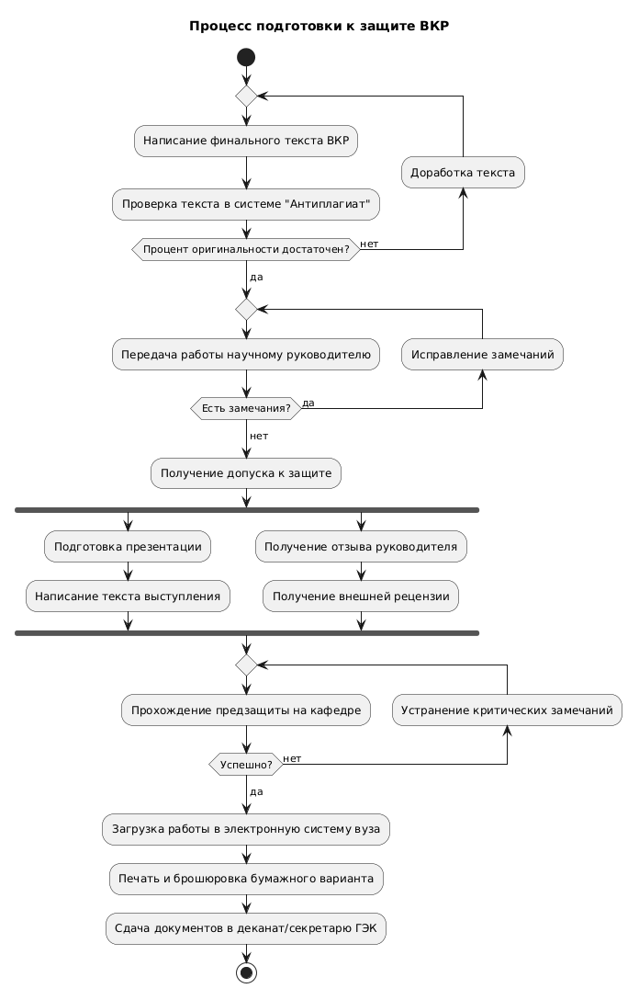

```puml
@startuml
title Процесс подготовки к защите ВКР

start

repeat
  :Написание финального текста ВКР;
  :Проверка текста в системе "Антиплагиат";
backward:Доработка текста;
repeat while (Процент оригинальности достаточен?) is (нет)
->да;

repeat
  :Передача работы научному руководителю;
backward:Исправление замечаний;
repeat while (Есть замечания?) is (да)
->нет;

:Получение допуска к защите;

fork
  :Подготовка презентации;
  :Написание текста выступления;
fork again
  :Получение отзыва руководителя;
  :Получение внешней рецензии;
end fork

repeat
  :Прохождение предзащиты на кафедре;
backward:Устранение критических замечаний;
repeat while (Успешно?) is (нет)
->да;

:Загрузка работы в электронную систему вуза;
:Печать и брошюровка бумажного варианта;
:Сдача документов в деканат/секретарю ГЭК;

stop
@enduml